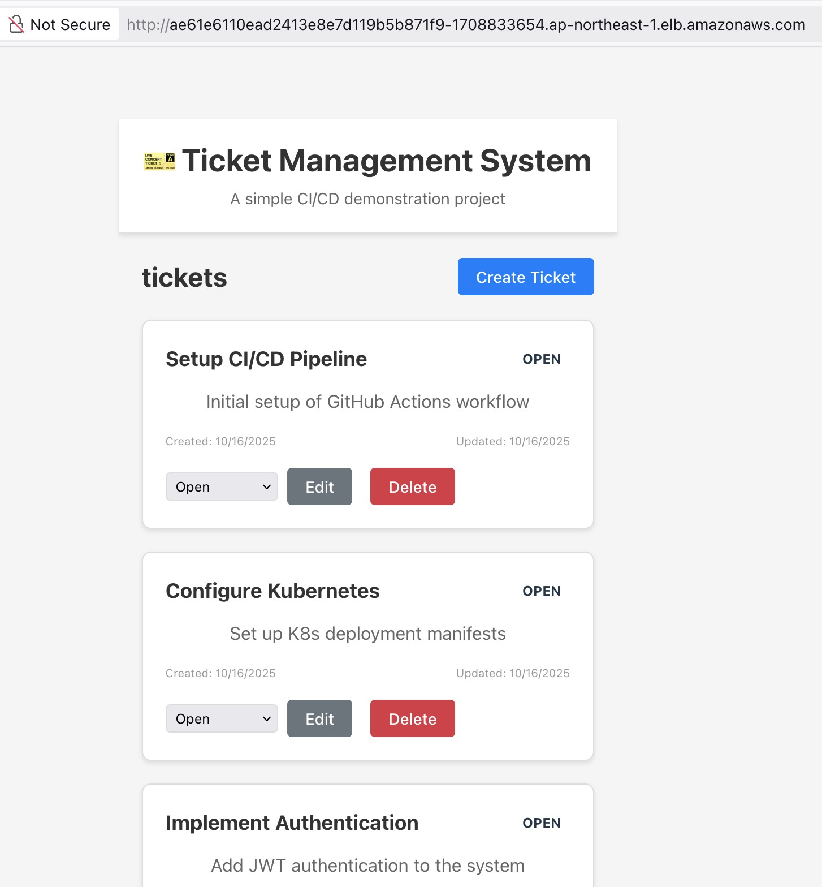

# Ticket Management System

[English](README.md) | [简体中文](README.zh-CN.md)

一个基于Spring Boot + Vue 3的现代化工单管理系统，演示完整的DevOps和CI/CD流程。

**Development:**
[](https://github.com/uniquejava/play-cicd001/actions/workflows/ci.yml)

**Production:**
[](https://github.com/uniquejava/play-cicd001/actions/workflows/ci.yml)




## 🎯 项目概览

这是一个**前后端分离的微服务架构**项目，展示了从开发到生产的完整DevOps实践：

- 🏗️ **现代化架构**: Spring Boot 3.5.6 + Vue 3 + TypeScript
- 🚀 **容器化部署**: Docker + Kubernetes + EKS
- 🔄 **CI/CD流水线**: GitHub Actions + Kubernetes + ArgoCD
- 📊 **可观测性**: 日志监控 + 健康检查
- 🛡️ **安全最佳实践**: 最小权限原则 + 安全扫描

## ⚡ 快速开始

### 📋 前置要求

- **AWS CLI**: 已配置凭证
- **kubectl**: Kubernetes命令行工具
- **Terraform**: 基础设施即代码工具
- **Docker**: 容器化工具
- **Helm**: Kubernetes包管理器

### 🚀 一键部署

```bash
# 克隆项目
git clone <repository-url>
cd play-cicd001

# 完整部署（基础设施 + 应用）
./scripts/deploy.sh

# 访问应用
# 前端: http://<负载均衡器地址>/
# 后端API: http://<负载均衡器地址>/api/tickets
```

### 🔧 本地开发

```bash
# 启动后端 (端口: 8080)
cd backend
mvn spring-boot:run

# 启动前端 (端口: 5173)
cd frontend
pnpm install && pnpm dev
```

## 🏗️ 系统架构

### 技术栈

**后端 (Spring Boot)**
- Java 17 + Spring Boot 3.5.6
- Maven构建工具
- RESTful API设计
- 内存数据存储（演示用）
- 健康检查端点

**前端 (Vue 3)**
- Vue 3 + Composition API + TypeScript
- Vite 7.1.7 + pnpm
- 响应式UI设计
- API服务封装

**基础设施 (AWS)**
- Amazon EKS 1.34 (Kubernetes)
- 2x t3.medium 工作节点
- Network Load Balancer (NLB)
- NGINX Ingress Controller
- Amazon ECR (容器镜像仓库)
- VPC + 子网 + 安全组

### 部署架构

```
┌─────────────────┐    ┌──────────────────┐    ┌────────────────────┐
│   前端 (Vue 3)   │────│  NGINX Ingress   │────│ Network Load Balancer │
└─────────────────┘    └──────────────────┘    └────────────────────┘
                                                        │
┌─────────────────┐    ┌──────────────────┐              │
│  后端 (Spring)   │────│  K8s Services    │──────────────┘
└─────────────────┘    └──────────────────┘
```

## 📚 文档导航

### 🏗️ 核心文档
- [**基础设施部署**](docs/INFRASTRUCTURE.md) - Terraform + EKS 完整部署指南
- [**CI/CD流程**](docs/CICD.md) - GitHub Actions + ArgoCD + Image Updater
- [**自动化脚本**](docs/SCRIPTS.md) - 部署和管理脚本使用指南

### 📋 其他文档
- [**项目说明**](docs/INSTRUCTION.md) - 项目背景和架构
- [**前端开发**](docs/frontend-README.md) - Vue 3开发说明
- [**项目计划**](docs/plan.md) - 开发里程碑
- [**Kind本地集群**](docs/infrastructure/kind.md) - 本地开发环境

## 🛠️ 开发指南

### 📁 项目结构

```
play-cicd001/
├── backend/                    # Spring Boot后端应用
├── frontend/                  # Vue 3前端应用
├── cicd/                      # CI/CD配置文件
│   ├── docker/               # Docker构建配置
│   ├── k8s/                  # Kubernetes部署文件
│   │   ├── backend/          # 后端K8s配置
│   │   ├── frontend/         # 前端K8s配置
│   │   └── argocd/           # ArgoCD配置
│   └── argocd/               # ArgoCD应用配置
├── infra/                     # Terraform基础设施
│   ├── modules/              # Terraform模块
│   │   ├── vpc/              # VPC网络配置
│   │   └── ecr/              # ECR镜像仓库
│   ├── main.tf               # 主配置文件
│   ├── variables.tf          # 变量定义
│   └── outputs.tf            # 输出配置
├── scripts/                   # 自动化脚本
│   ├── deploy.sh             # 一键部署脚本
│   ├── destroy.sh            # 一键删除脚本
│   ├── docker/               # Docker构建脚本
│   ├── k8s/                  # Kubernetes管理脚本
│   └── terraform/            # Terraform管理脚本
├── .github/workflows/         # GitHub Actions工作流
├── docs/                      # 项目文档
│   ├── INFRASTRUCTURE.md      # Terraform + EKS 部署指南
│   ├── CICD.md               # CI/CD 完整流程
│   ├── SCRIPTS.md            # 自动化脚本指南
│   ├── INSTRUCTION.md        # 项目背景架构
│   └── plan.md               # 开发里程碑
├── records.txt                # 部署记录
└── CLAUDE.md                  # Claude Code配置
```

### 🔧 常用命令

```bash
# 🚀 部署管理
./scripts/deploy.sh                               # 完整部署（基础设施 + 应用）
./scripts/deploy.sh --skip-infra                  # 仅部署应用到现有集群
./scripts/deploy.sh --skip-apps                   # 仅部署基础设施
./scripts/destroy.sh                              # 一键删除所有资源（节省费用）

# 🏗️ 基础设施管理
cd infra
terraform init                                    # 初始化Terraform
terraform plan                                    # 查看执行计划
terraform apply                                   # 部署基础设施
terraform destroy                                 # 删除基础设施
aws eks --region ap-northeast-1 update-kubeconfig --name tix-eks-fresh-magpie  # 配置kubectl

# ☸️ Kubernetes运维
kubectl get pods -n ticket-dev                    # 查看Pod状态
kubectl get services -n ticket-dev                # 查看服务
kubectl get ingress -n ticket-dev                 # 查看Ingress
kubectl logs -f deployment/backend-deployment -n ticket-dev  # 查看后端日志
kubectl logs -f deployment/frontend-deployment -n ticket-dev # 查看前端日志

# 🚢 ArgoCD管理
argocd app list                                   # 列出所有应用
argocd app get ticket-system-dev                # 获取应用状态
argocd app sync ticket-system-dev               # 手动同步应用
argocd app logs ticket-system-dev               # 查看应用同步日志
argocd cluster list                              # 查看集群列表
kubectl get applications -n argocd               # 查看ArgoCD应用资源
kubectl get appprojects -n argocd                # 查看ArgoCD项目

# 🔍 ArgoCD Image Updater调试
kubectl logs -n argocd -l app.kubernetes.io/name=argocd-image-updater -f  # 查看Image Updater日志
kubectl get pods -n argocd -l app.kubernetes.io/name=argocd-image-updater  # 检查Image Updater状态

# 🔐 ECR凭据管理 (ArgoCD Image Updater)
./scripts/setup-ecr-credentials.sh               # 生成ECR credentials
kubectl apply -k cicd/k8s/argocd/               # 部署ECR凭据到ArgoCD

# 🐳 本地开发
cd backend && mvn spring-boot:run                 # 启动后端 (端口: 8080)
cd frontend && pnpm install && pnpm dev           # 启动前端 (端口: 5173)

# 🔨 本地构建
docker build -f cicd/docker/backend/Dockerfile -t ticket-backend ./backend
docker build -f cicd/docker/frontend/Dockerfile -t ticket-frontend ./frontend
./scripts/docker/build-frontend.sh production    # 前端生产构建
./scripts/docker/build-frontend.sh development   # 前端开发构建

# 🧪 测试
cd backend && mvn test                            # 后端测试
cd frontend && pnpm test                          # 前端测试
curl http://localhost:8080/api/tickets            # API测试

# 📊 部署验证
LB_URL=$(kubectl get ingress ticket-management-ingress -n ticket-dev -o jsonpath='{.status.loadBalancer.ingress[0].hostname}')  # 获取负载均衡器地址
curl http://$LB_URL/api/tickets                   # 测试线上API
curl -I http://$LB_URL/                          # 测试前端页面

# 📱 GitHub Actions监控
gh run list --repo uniquejava/play-cicd001       # 查看CI/CD运行状态
gh run view <run-id> --repo uniquejava/play-cicd001  # 查看具体运行详情
gh run rerun <run-id> --repo uniquejava/play-cicd001  # 重新运行失败的workflow
```

## 📊 成本估算

| 资源 | 月费用 | 说明 |
|------|--------|------|
| EKS控制平面 | ~$73 | Kubernetes集群管理 |
| EC2实例 (2x t3.medium) | ~$60 | 工作节点 |
| NAT网关 | ~$35 | 私有子网出网关 |
| EIP | ~$3.65 | 弹性IP地址 |
| 数据传输 | ~$5-10 | 流量费用 |
| **总计** | **~$170** | **预估月费用** |

> 💡 **费用控制**: 使用完毕后请运行 `./scripts/destroy.sh` 清理资源以避免不必要的费用。

## 🎯 功能特性

### 核心功能
- ✅ **工单管理**: 创建、编辑、删除工单
- ✅ **状态追踪**: 待处理 → 处理中 → 已完成
- ✅ **RESTful API**: 标准化API接口
- ✅ **响应式设计**: 支持多设备访问
- ✅ **实时更新**: 前后端数据同步

### 技术特性
- ✅ **容器化**: Docker镜像构建
- ✅ **微服务**: 前后端分离架构
- ✅ **负载均衡**: NGINX Ingress Controller
- ✅ **健康检查**: 服务状态监控
- ✅ **自动扩缩容**: Kubernetes HPA（可配置）

## 🔄 CI/CD流水线

### 开发流程
1. **代码提交** → GitHub仓库
2. **自动构建** → GitHub Actions CI
3. **镜像构建** → Docker + ECR推送
4. **自动部署** → ArgoCD Image Updater
5. **服务发布** → Kubernetes集群

### 分支策略
- `main`: 生产环境分支
- `develop`: 开发环境分支
- `feature/*`: 功能开发分支
- `hotfix/*`: 紧急修复分支

## 🧪 测试

测试命令已包含在上方"常用命令"部分的"🧪 测试"分类中。

## 🛡️ 安全特性

- **最小权限**: IAM角色权限最小化
- **网络隔离**: VPC私有子网部署
- **容器安全**: 非root用户运行
- **镜像扫描**: ECR自动安全扫描
- **密钥管理**: AWS Secrets Manager（可扩展）

## ⚠️ 重要提醒

在不使用项目时，请运行 `./scripts/destroy.sh` 删除所有AWS资源以避免产生费用！

---

## 📄 许可证

本项目采用 MIT 许可证。

**📅 最后更新**: 2025-10-17